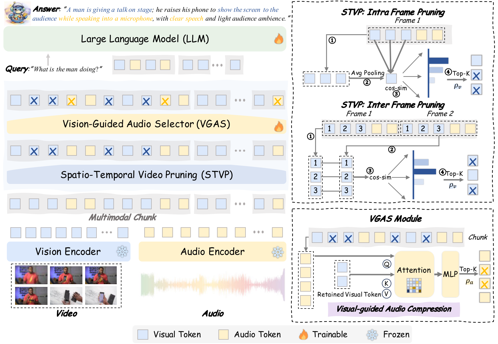
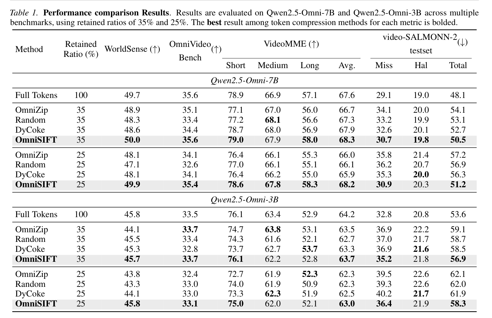
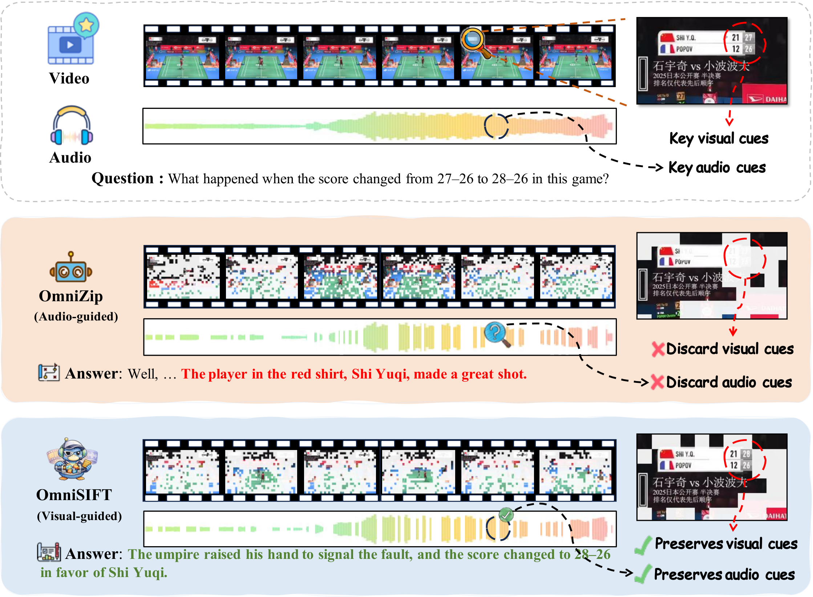

<p align="center">
  
</p>

<h1 align="center">
  OmniSIFT: Modality-Asymmetric Token Compression for Efficient Omni-modal Large Language Models
</h1>

<p align="center">
  Yue Ding<sup>1,2,*</sup>, Yiyan Ji<sup>3,*</sup>, Jungang Li<sup>4</sup>, Xuyang Liu<sup>5</sup>, Xinlong Chen<sup>1</sup>, Junfei Wu<sup>1</sup>, Bozhou Li<sup>6</sup>, Bohan Zeng<sup>6</sup>, Yang Shi<sup>6</sup>, Yushuo Guan<sup>2</sup>, Yuanxing Zhang<sup>2</sup>, Jiaheng Liu<sup>3</sup>, Qiang Liu<sup>1</sup>, Pengfei Wan<sup>2</sup>, Liang Wang<sup>1</sup>
</p>

<p align="center">
  <sup>1</sup>NLPR, Institute of Automation, Chinese Academy of Sciences (CASIA)&nbsp;&nbsp;
  <sup>2</sup>Kling Team, Kuaishou Technology&nbsp;&nbsp;
  <sup>3</sup>Nanjing University<br>
  <sup>4</sup>The Hong Kong University of Science and Technology (Guangzhou)&nbsp;&nbsp;
  <sup>5</sup>Sichuan University&nbsp;&nbsp;
  <sup>6</sup>Peking University<br>
  <sup>*</sup>Equal contribution
</p>

<p align="center">
  <em>Video-guided audio and modality-asymmetric omni-token compression for efficient audio-video understanding.</em>
</p>

<p align="center">
  <a href="https://arxiv.org/abs/2602.04804"></a>
  <a href="https://arxiv.org/abs/2602.04804"></a>
  <a href="https://mp.weixin.qq.com/s/49yUBxtEFqdST85g4ROQZQ"></a>
  <a href="https://huggingface.co/dingyue1011/OmniSIFT-7B"></a>
  <a href="LICENSE"></a>
</p>

## Contents

- [News](#-news)
- [Highlights](#-highlights)
- [Method Overview](#method-overview)
- [Main Results](#main-results)
- [Case Study](#case-study)
- [Core Code](#-core-code)
- [Installation](#installation)
- [Quick Start](#quick-start)
- [Compression Parameters](#compression-parameters)
- [Acknowledgement](#acknowledgement)
- [Citation](#citation)

## 🔥 News

- `2026.05.01` 🎉🎉 OmniSIFT has been accepted to **ICML 2026**!
- `2026.02.04` 📄✨ We introduce OmniSIFT, a modality-asymmetric token compression framework for efficient Omni-LLM inference. The paper is available on arXiv: [arXiv:2602.04804](https://arxiv.org/abs/2602.04804).

## 📌 Highlights

OmniSIFT reduces the long audio-video context in Omni-LLMs with a modality-asymmetric design: video tokens are first compressed into informative visual anchors, which then guide audio token compression.

- ⚡ **Video-Guided Modality-Asymmetric Compression:** OmniSIFT treats video and audio tokens asymmetrically, using key video tokens to guide audio token selection for omni-modal token compression.
- 🎞️ **Spatio-Temporal Video Token Pruning:** The video branch removes redundant patches by combining spatial similarity within frames and temporal similarity across adjacent frames.
- 🔊 **Cross-Attention Audio Token Selection:** The retained key video tokens act as visual anchors and guide audio compression through cross-attention, preserving audio cues aligned with visual context.
- 🚀 **Efficient Omni-LLM Inference:** OmniSIFT substantially shortens the multimodal prefill context while maintaining strong audio-video understanding performance.

## Method Overview

OmniSIFT follows a two-stage modality-asymmetric compression pipeline. STVP first removes spatial and temporal redundancy in video tokens to produce compact visual anchors; VGAS then selects audio tokens conditioned on these visual anchors before feeding the compressed multimodal sequence into the LLM backbone.

<p align="center">
  
</p>

## Main Results

We evaluate OmniSIFT on Qwen2.5-Omni-7B and Qwen2.5-Omni-3B across multiple audio-video benchmarks under 35% and 25% token retained ratios. OmniSIFT consistently achieves the best performance among compression methods and can match or surpass the full-token baseline in several settings while using much shorter multimodal contexts.

<p align="center">
  
</p>

## Case Study

This visualization shows how OmniSIFT preserves salient visual dynamics and contextually aligned audio cues under aggressive compression, enabling accurate reasoning over fine-grained audio-video events.

<p align="center">
  
</p>

## 🧱 Core Code

- OmniSIFT compression logic: [`omnisift/compression_units.py`](omnisift/compression_units.py)
- Qwen2.5-Omni integration with compression hooks: [`omnisift/modeling_qwen2_5_omni.py`](omnisift/modeling_qwen2_5_omni.py)
- Media preprocessing utilities: [`qwen-omni-utils/`](qwen-omni-utils/)

## Installation

Please follow the environment setup and dependency installation instructions in the official [Qwen2.5-Omni](https://github.com/QwenLM/Qwen2.5-Omni) codebase.

## Quick Start

Download the OmniSIFT-7B checkpoint from [Hugging Face](https://huggingface.co/dingyue1011/OmniSIFT-7B), then run inference:

```python
import torch
from transformers import AutoProcessor
from qwen_omni_utils import process_mm_info
from omnisift import Qwen2_5OmniForConditionalGeneration

model_path = "dingyue1011/OmniSIFT-7B"

processor = AutoProcessor.from_pretrained(model_path)
model = Qwen2_5OmniForConditionalGeneration.from_pretrained(
    model_path,
    torch_dtype="auto",
    device_map="auto",
)

# Optional: tune compression ratios.
model.thinker.compression_config = {
    "rho_audio": 0.3,
    "rho_video": 0.7,
}

messages = [
    {
        "role": "user",
        "content": [
            {"type": "video", "video": "file:///path/to/video.mp4"},
            {"type": "text", "text": "Describe the audio and video."},
        ],
    }
]

text = processor.apply_chat_template(messages, tokenize=False, add_generation_prompt=True)
audios, images, videos = process_mm_info(messages, use_audio_in_video=True)
inputs = processor(text=text, images=images, videos=videos, audio=audios, padding=True, return_tensors="pt")
inputs = inputs.to(model.device)

generated_ids, generated_audio = model.generate(**inputs)
response = processor.batch_decode(generated_ids, skip_special_tokens=True, clean_up_tokenization_spaces=False)
print(response[0])
```

## Compression Parameters

`rho_audio` controls the fraction of audio tokens removed within each chunk.
`rho_video` controls the fraction of video tokens removed from the selected spatial/temporal positions.

Lower values preserve more tokens. 

## Acknowledgement

Thanks to [Qwen2.5-Omni](https://github.com/QwenLM/Qwen2.5-Omni), [ms-swift](https://github.com/modelscope/ms-swift), [OmniZip](https://arxiv.org/abs/2511.14582), [AVoCaDO](https://arxiv.org/abs/2510.10395), [VidCom2](https://arxiv.org/abs/2505.14454), and [TimeChat-Online](https://arxiv.org/abs/2504.17343) for their great work and codebase.

## Citation

```bibtex
@article{ding2026omnisift,
  title={OmniSIFT: Modality-Asymmetric Token Compression for Efficient Omni-modal Large Language Models},
  author={Ding, Yue and Ji, Yiyan and Li, Jungang and Liu, Xuyang and Chen, Xinlong and Wu, Junfei and Li, Bozhou and Zeng, Bohan and Shi, Yang and Guan, Yushuo and others},
  journal={arXiv preprint arXiv:2602.04804},
  year={2026}
}
```
